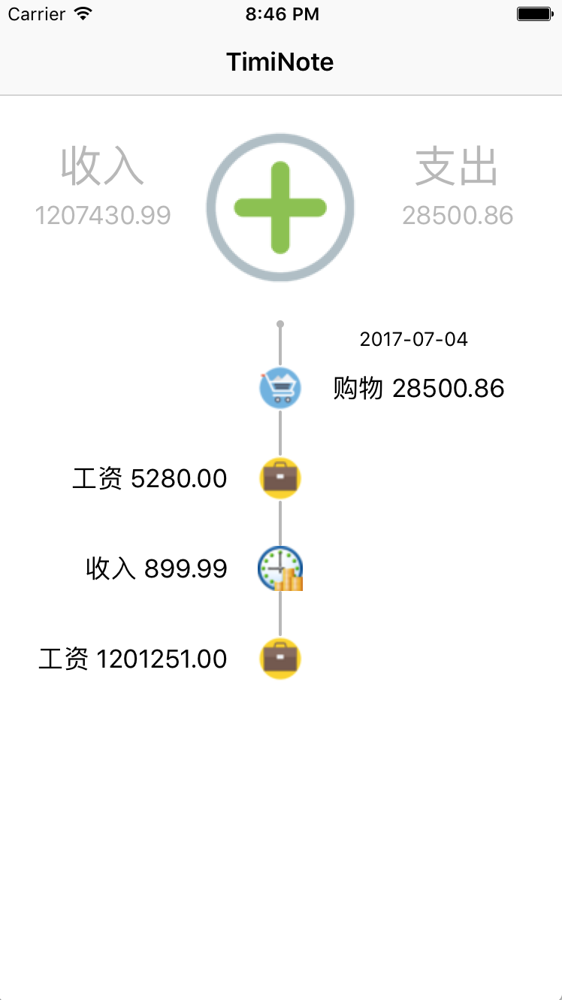
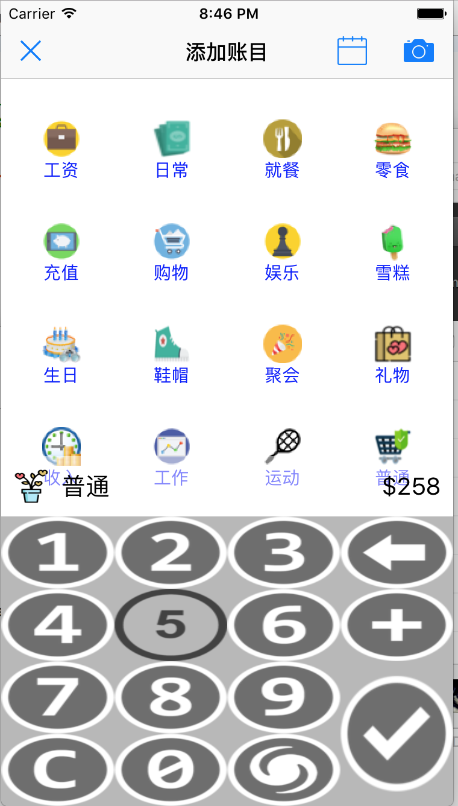

# Timi Note 时光记账

*15天打造出来的app，从设计到扒图，纯粹练手，欢迎交流*

演示Demo：**有bgm噢ψ(｀∇´)ψ**（github并不支持video，所以转成了gif，当然我把视频也传上来了）

<video crossorigin="anonymous" loop="" controls  width="100%" height="350"><source src="./TimiDemo.mp4"></video>

 

**如果gif演示太卡的话，点击gif，在新界面打开就可以流畅显示了**

主要实现点：

* 两个界面的传值与通信
* 数据持久化，存入coredata
* 主界面使用tableview，界面二使用collectionView
* 界面间跳转动画
* 界面二点击logo自定义动画（一个基本动画和一段贝塞尔曲线动画，详情见代码）
* 在界面二界面滑动时键盘会自动隐藏，隐藏状态的键盘被点击后会自动弹出
* 界面二的键盘会有错误提示，已经尽力想到各种情况了，数值越位，小数点等。
* 主界面的每一项都可以修改
* 每条数据都有时间戳，会按时间戳分组排序并显示，新添加的数据会优先显示在最上面。
* 每条数据都可以修改，并且主界面的收入和支出会相应地修改
* 等等

后期维护更新方向：

* 增加网络请求，把数据同步到网络上
* 增加日历插件，用户可以自定义记录添加的时间
* 界面二长按logo会进入抖动状态，并且拖拉可以改变其顺序

##### 程序界面

欢迎star与交流分享